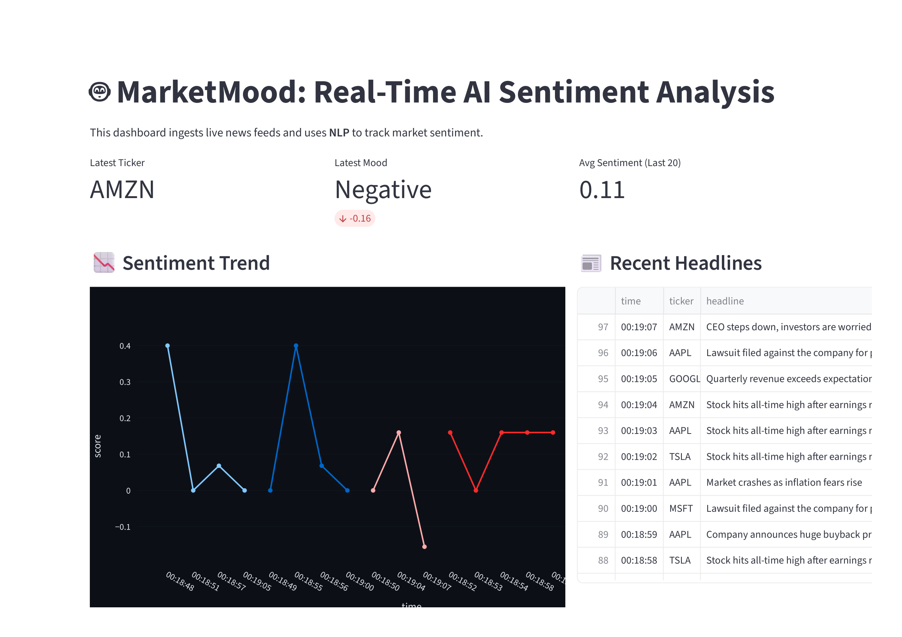

# 📈 MarketMood: Real-Time Financial Sentiment Engine

## 🚀 Overview
A low-latency full-stack application that visualizes real-time market sentiment. Designed to help traders identify bullish/bearish trends from unstructured news data streams with sub-100ms response times.

## 🛠️ Tech Stack
* **Frontend:** Streamlit
* **Backend:** Python, NLTK/TextBlob
* **Visualization:** Plotly (Real-time updates)
* **Data Source:** Live News API / WebSocket

## 💡 How it Works
1. **Ingestion:** Connects to live financial text streams.
2. **NLP Engine:** TextBlob processes text chunks to calculate Polarity (-1 to +1) and Subjectivity.
3. **Rendering:** Streamlit Session State manages the data buffer to render live charts without page reloads.

## ⚡ Performance Optimization
* **Latency:** optimized text processing to ensure near real-time visualization.
* **State Management:** Used session caching to prevent redundant API calls.
